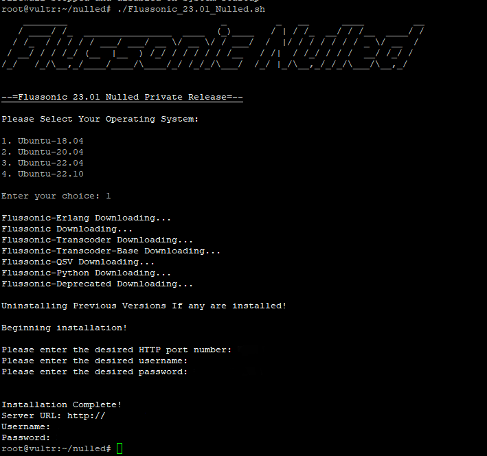

This is the best flussonic nulled Script that I found, so thought I would Share, It supports most ubuntu operating systems.

chmod +x Flussonic_23.01_Nulled.sh

./Flussonic_23.01_Nulled.sh

Then choose your operating system

Then when prompted Choose Your desired port number And administrator username and password

It's that easy

